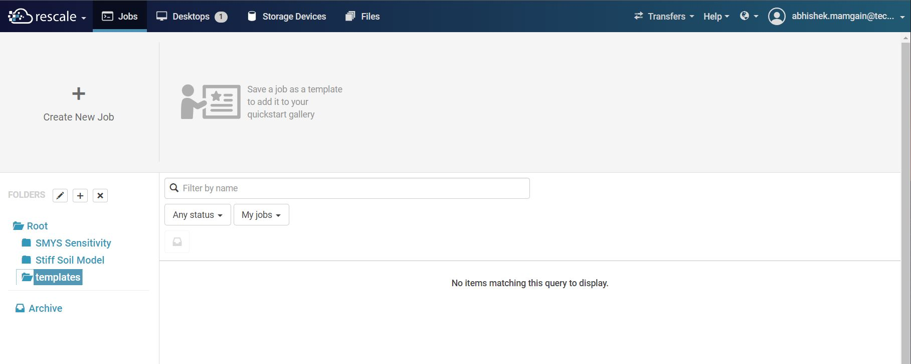
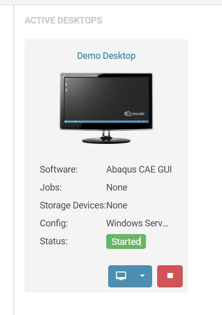
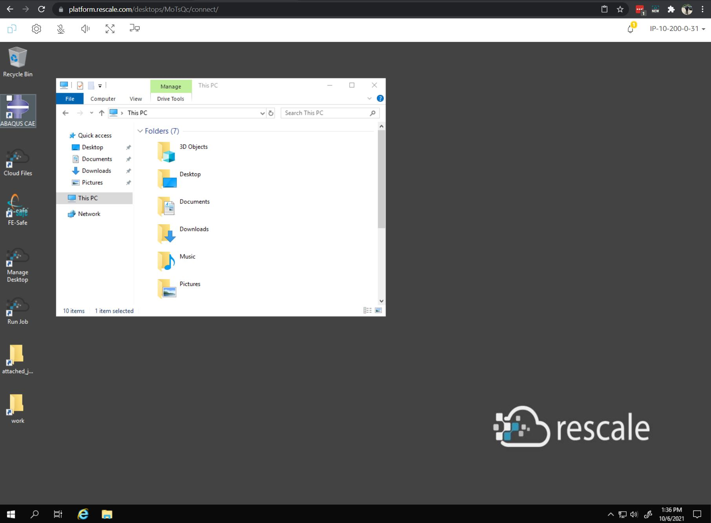
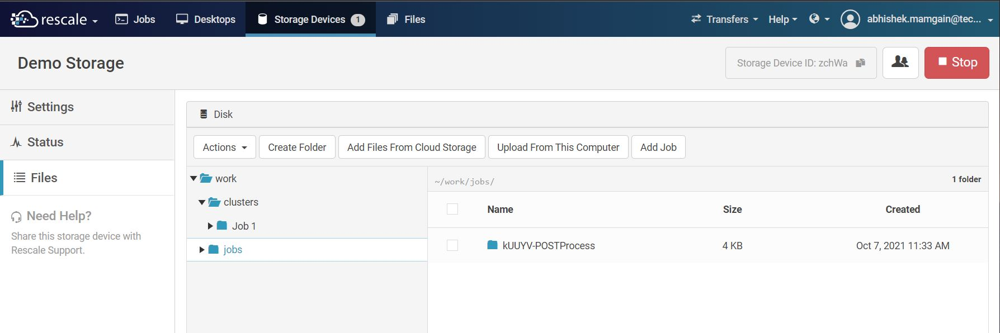

Introduction
==============

Getting Access
---------------
To get access to the Rescale platform an online course **Rescale Basics** on :guilabel:`iLearn` needs to be completed. Once the course is completed, send the certificate (or screenshot if certificate in unavailable) to ashok.jallan@technipfmc.com. He will then send you further instructions on how to sign up on Rescale platform.

User Interface
---------------
When you log in to the Rescale platform, the following choices appear on the header.

Jobs
*****
This is where all the jobs will get executed. A cloud instance is created when the job is submitted and it terminates when the job is completed. Hardware and software requirements are specified when the job is created. All input and generated files during the analysis are stored under the job ID.  See :ref:`Running First Job` for more details.

.. important:: 
   Jobs have storage **time limit** of **30 days** after which they are moved to the recycle bin. After 60 days in recycle bin, the jobs will be permanently deleted.

Desktops
*********
These are fully functional desktops that can be instantiated just like jobs. A remote connection can be establisted with these desktops and the user can interact with throuigh a graphic user interface simillar to Citrix.

Storage Devices
*******************
The cloud storage device works as the network attached storage with **no time limit**. The charges for using storage are billed hourly simillar to :ref:`Jobs` and :ref:`Desktops`. It can be used as a common place to store and share files within the team. Simillar to G or S Drive but on the Rescale cloud. 

Files
***********
Files tab works as shared folder between the jobs. If you need to share analysis files between two jobs then files tab can be useful. 30/60 day time limit applies to the files saved here.
