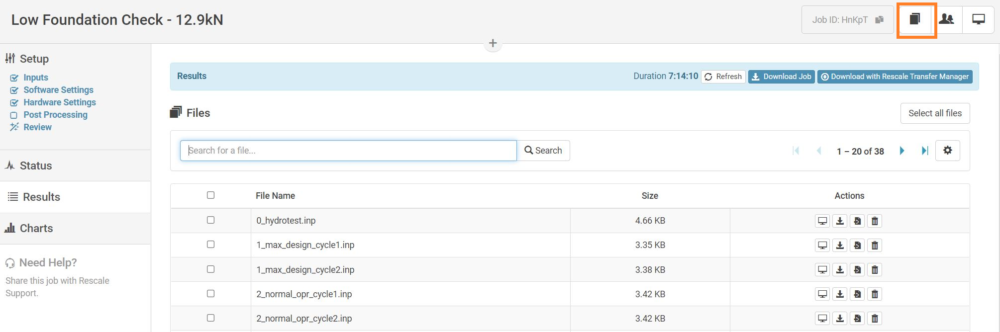

Downloading Files
=======================

Download a Job
----------------
After your basic job has finished, you will be presented with the **Results** page. From this page you can access all the files associated with the job. On this page you can download a zip file containing all files associated with the run by clicking the blue Download button, which is highlighted in green. This zip file includes both input and output files.

Single Job
    .. image:: imgs/run-results.png
        :width: 800px
        :align: center  

Multiple Jobs
    .. image:: imgs/all-run.png
        :width: 800px
        :align: center  

Automatic Downloads
--------------------
You can use **Rescale Transfer Manager** to automatically download the jobs to your computer as soon as they are completed. Head to `<https://platform.rescale.com/user/settings/api-key/>`_ to configure and install the software.

Cloning a Job
--------------------------
Cloning allows replicating the job setup and files associated with it. This feature is useful when small changes are needed to be made or fixed. It is also possible to clone jobs that are shared with you by other users so that you can run the jobs yourself.

