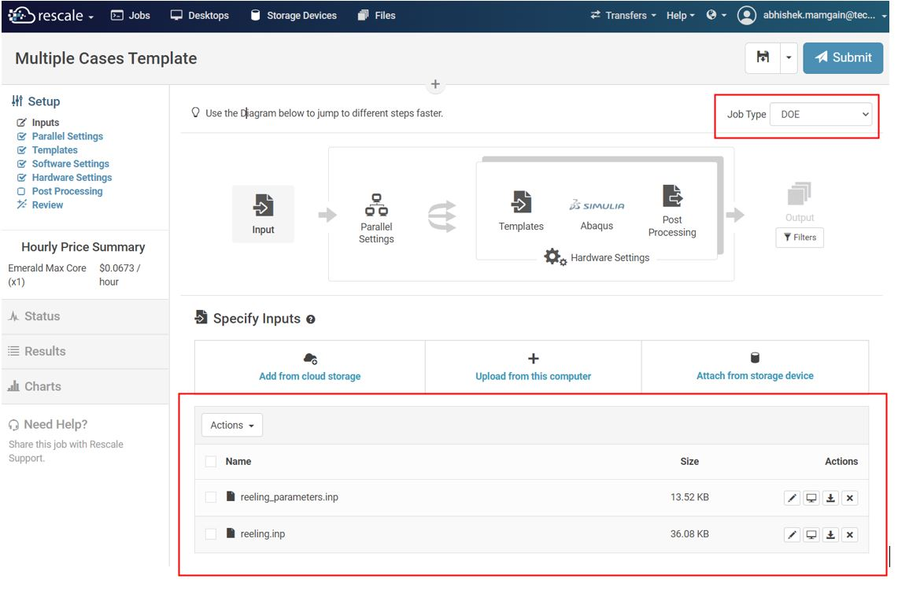
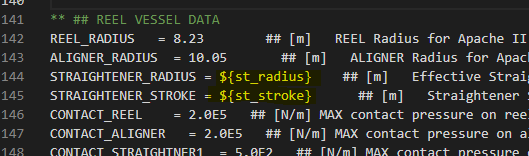
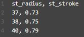
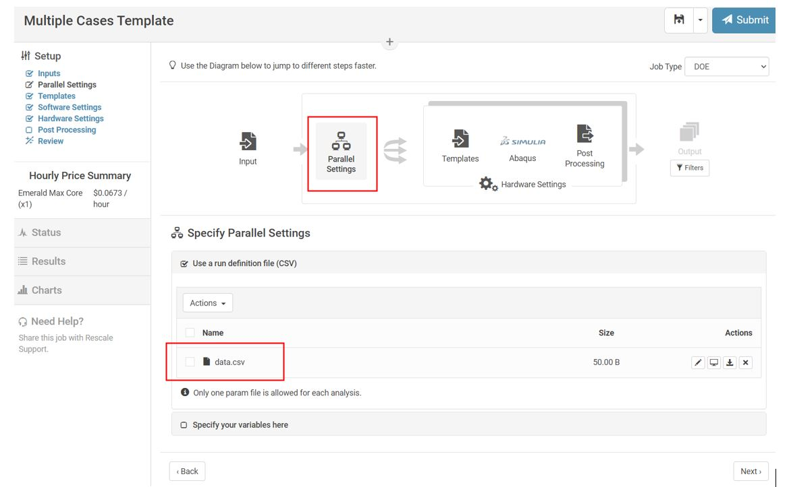
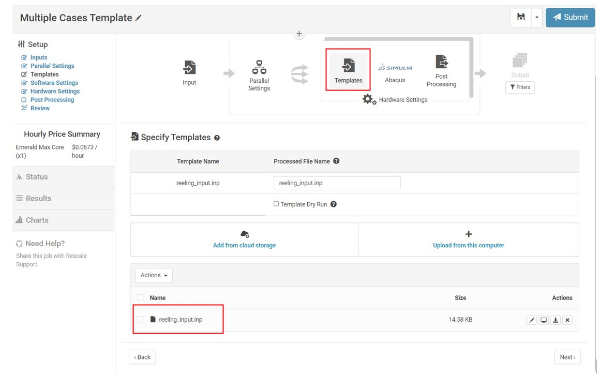
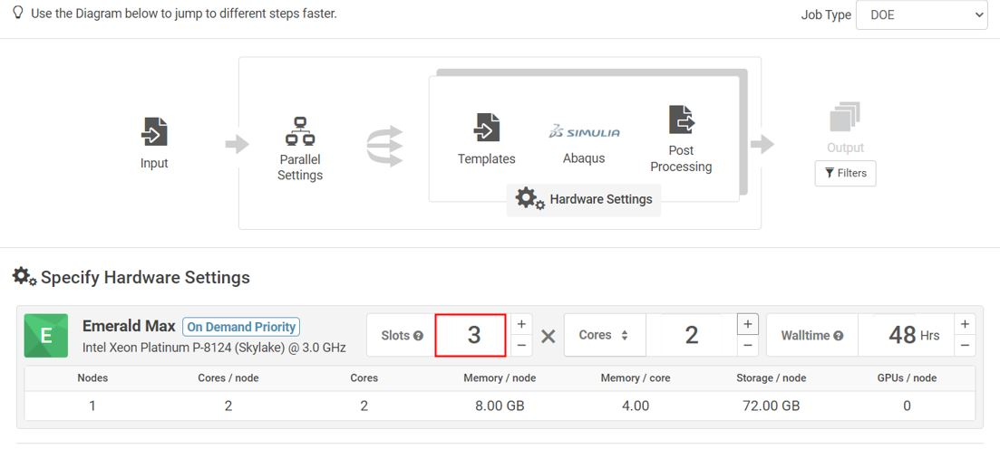
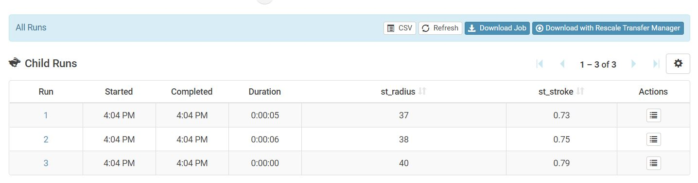
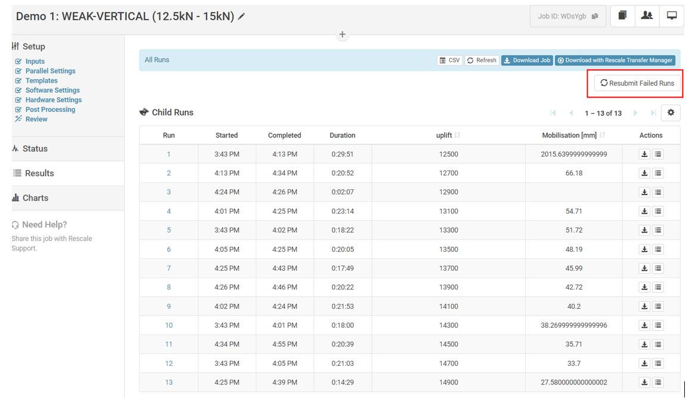
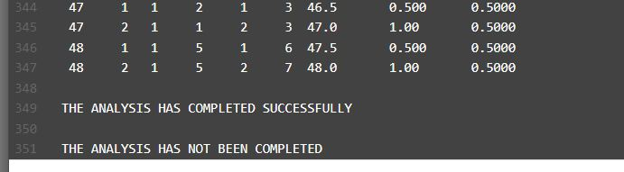

Batch Processing
================

Reference Job: ``nRRKeb``

This section shows how to setup Design of Experiments (DOE) with variable design pattern for Abaqus analysis. We will simulate to perform a parametric sweep of the different straightner radius and straighner stroke using DOE job type option available on Rescale.

Create Job
----------------

On the Rescale Platform, start by clicking **Create New Job**. Change the **Job type** to DOE as shown in the screen shot below. You can see the platform configuration layout change to DOE setup. Add supplementary input files using the Specify Inputs window.

Create Template and Cases
-------------------------
Modify the main input file **reeling_input.inp** template with keyword in the ``${<variable-name>}`` format so that rescale can find which value to replace.

Create **data.csv** file with description of the values you want to use where each row represents a new case. Use header names same as the keyword names in the previous step.

Upload Files
--------------
In parallel settings, select :guilabel:`Use a run definition file (CSV)` and upload the **data.csv** file to define variable parameters. Alternatively, you can define variable range using :guilabel:`Specify your variables here` section.

Next, in templates section, upload the main input file  **reeling_input.inp**.

Hardware Settings
--------------------

In hardware settings, specify the number of slots (parallel executions) and cores per slot you want to use. More slots means more licences used simultaneously. Refer to section :ref:`Hardware Setting` to understand how to configure cost effective hardware.

Results
--------------
Once analysis is somplete, individual runs with specified variable value will be available in Results section to explore. 

Resubmit Failed Jobs
----------------------
Reference Job: ``WDsYgb``

Sometimes not all jobs will be completed. It may be due to convergence issues (most likely), pipe buckling or input error. In those cases Rescale keeps track of what cases have not been completed so you can resubmit them. Click :guilabel:`Resubmit Failed Runs` to see what jobs have not been completed.

But take this feature with a pinch of salt. Sometimes Rescale will include a few completed jobs in this list. This is due to an unknown error that marks the ``.sta`` file as incomplete even after all the steps have been completed. Re-check your ``.sta`` files so that only incomplete jobs are resubmitted and remove completed jobs from the csv file.

